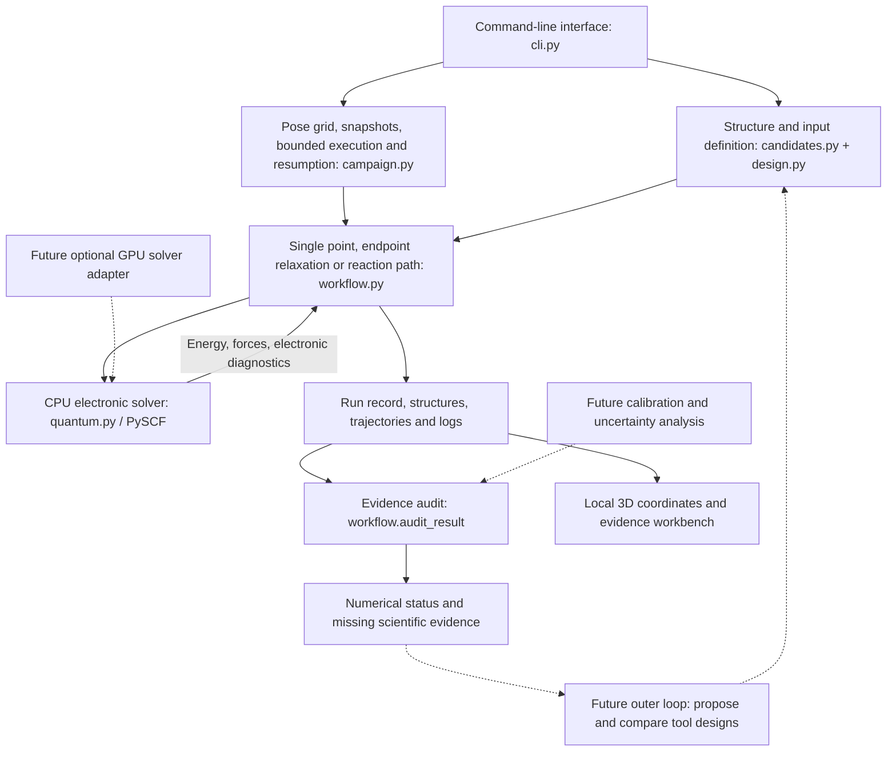

# Architecture and computing requirements

The current system is a local Python research application that evaluates explicit atomic structures using quantum chemistry. Its layers cover structure definition, the electronic solver, constrained optimization, evidence auditing, bounded pose campaigns, a command-line interface and an independent read-only visual workbench. An optimizer that autonomously discovers better tool structures would be a future outer loop around these layers.

**A GPU is not required for the initial 53-atom candidate.** The implemented calculation path uses CPU PySCF, ASE and NumPy. The candidate contains two finite diamondoid clusters, C22H31, with a neutral doublet electronic state. A full reaction-path calculation requires many electronic calculations; its resource requirements depend on the basis, method, images and convergence behavior. This architecture does not imply a completion time for a particular computer.

The [computation planner](../research/compute-planning/README.md) uses the saved direct/DF timings with explicit stage and cache assumptions. It counts both ordinary and climbing NEB, endpoint work and Hessian displacements. Its projections are scenarios from uncontrolled overlapping measurements, not guaranteed runtimes or accelerator speedups.

The [GPU readiness tools](../research/gpu-readiness/README.md) inspect the environment, prepare a bounded CPU/GPU comparison plan from archived coordinates, and compare supplied result records. They launch no chemistry and implement no GPU solver. Actual GPU execution, energy/force parity and acceleration remain untested.

## Calculation pipeline

Solid arrows show the current workflow. Dashed arrows show proposed extensions.

The solver provides energies and forces. The optimizer uses those quantities to move atoms. The audit controls what may be concluded from the result. A future design-search layer would choose *which structure or tool pose to evaluate next*; it must not redefine a failed calculation as a favorable design.

## Modules and responsibilities

| Layer | Actual modules | Implemented responsibility | Boundary |
|---|---|---|---|
| Structure and input definition | `nanodesign/candidates.py`, `nanodesign/design.py` | Generate unrelaxed H-abstraction endpoints; preserve atom indices; load explicit coordinates, electronic settings and anchors; check units, geometry and metadata; hash inputs. | Generated structures and nominal bonds are starting hypotheses. |
| Electronic solver | `nanodesign/quantum.py` | ASE calculator backed by CPU PySCF; finite-cluster Kohn–Sham DFT energy and analytical forces; optional explicit D3 correction; SCF, spin and software diagnostics. | A converged electronic calculation is not a calibrated prediction or proof of the correct state. |
| Constrained optimization | `nanodesign/workflow.py` | Single-point evaluation; FIRE endpoint relaxation; endpoint checks; IDPP initialization, ordinary NEB and climbing-image NEB; candidate barrier reporting. | Fixed-anchor, zero-temperature electronic potential surface; no operating cycle or kinetic reliability model. |
| Evidence and accuracy checks | `nanodesign/workflow.py`, `nanodesign/benchmark.py`, `nanodesign/stationary.py`, `nanodesign/highlevel.py`, `nanodesign/method_comparison.py` | Report numerical status separately; compare reference-geometry energies and paired DFT/CCSD(T) results; characterize finite-difference vibrational modes; retain `design_validated: false`. | Fixed-geometry discrepancies and local curvature are evidence, not a quantitative tool-reliability estimator. |
| Calculation interface | `nanodesign/cli.py`, `nanodesign/__main__.py` | Candidate creation, checks, calculation, reference comparison, characterization and campaign commands; explicit output destinations and failure/interruption exit status. | Local command-line execution; no remote scheduler or hardware controller. |
| Visual workbench | `workbench/server.py`, `workbench/static/` | Local 3D coordinate inspection, measurements, pose selection and saved calculation/reference evidence; explicit import boundaries and source links. | Read-only; no graphical coordinate editor, solver execution or design validation. |
| Campaign orchestration | `nanodesign/campaign.py` | Enumerate explicit poses, snapshot comparable inputs, execute a bounded number of serial jobs, preserve retries, lock concurrent workers, and report numerical/scientific evidence. | No learned objective, autonomous topology search, calibrated ranking, runtime budget or distributed scheduling. |
| Electronic starting-guess surveys | `nanodesign/state_scan.py` | Freeze coordinates and explicit settings, evaluate requested guesses serially with fresh calculators, preserve failures, report converged-subset energy spread and completeness. | No orbital-stability analysis, state tracking, energy-based winner selection or ground-state certificate. |
| Evidence transport | `nanodesign/bundle.py` | Copy an explicitly selected directory without changing bytes; bound inventory/size, preserve failures, verify checksums and paths after relocation. | File integrity only; no authenticity, external-reference closure or scientific validation. |

### Structure and solver contract

A design consists of an explicit `design.json` plus initial and final structures. Coordinates must be declared in Å. Atom order and identity remain unchanged across endpoints. Fixed atom indices define the mechanical boundary, and those anchor coordinates must be identical at both ends of a reaction path. A moved tool requires a separately specified pose.

The solver receives atomic numbers and coordinates plus charge, spin, functional, basis and numerical settings. It returns energy in eV, forces in eV/Å and diagnostics. PySCF's `spin` is the alpha-minus-beta electron count; the intended doublet uses `spin=1`. The current adapter uses restricted DFT for spin zero and unrestricted DFT otherwise. It does not automatically switch electronic methods to recover from failure.

`scf_initial_guess` explicitly chooses one of `minao`, `atom`, `1e`, or `huckel` for DFT, with `minao` preserving historical behavior. New records serialize the effective choice and mark electronic-state identity and the ground state as unverified. A separate setting controls HF starting guesses in the coupled-cluster reference. Neither setting automatically scans or selects among solutions.

The default PBE0/def2-SVP calculation with D3(BJ) is an explicit approximation awaiting reaction-specific calibration. The geometry workflow uses the ASE calculator interface; this is the intended boundary for adding another solver. The current workflow still instantiates `PySCFCalculator` directly, so an interchangeable backend selector has not been implemented.

### Optimization and evidence contract

Endpoint relaxation keeps the anchors fixed and checks the intended hydrogen basin. Where nominal connectivity metadata exists, an additional geometric contact screen flags possible rearrangement. Neither check measures electronic bond order.

The path stage requires converged, distinct endpoints, then optimizes a band of images. It reports a candidate electronic barrier only when a converged band has an interior energy maximum. That value is referenced to the initial endpoint at the chosen pose. It is not automatically a separated-reactant barrier, a free-energy barrier or a probability of successful assembly.

Each run requires a new output directory. During execution, `result.json` records progress and final status; structures, trajectories and logs support inspection. Input hashes, settings, unit conventions and solver version information identify the calculation. Failures and interruptions remain visible. The audit does not promote numerical convergence into physical validation.

## Implemented capabilities and planned work

| Capability | Current state | Work required before a stronger claim |
|---|---|---|
| Explicit tool/target geometry | Implemented for one H-abstraction candidate; custom finite-cluster endpoints can be loaded. | Additional tool families, realistic surfaces, attachment geometry and fabrication evidence. |
| Electronic energies and forces | CPU DFT adapter implemented. | Independent calibration against appropriate high-level calculations or measurements. |
| Geometry and reaction-path optimization | Implemented with fixed anchors and convergence checks; optional finite-difference mode characterization. | Saddle refinement, displacement-step convergence and verified path connectivity. |
| Scientific provenance | Input hashes, method settings, diagnostics and run artifacts implemented; source-checked reference comparisons and executed SVP/TZVP results saved. | Reconciled benchmark targets and expanded calibration across relevant reactions. |
| Uncertainty | Missing evidence is listed; no confidence interval is calculated. | Separate numerical error, method error, model-size/boundary effects and operational variability. |
| Design campaigns | Explicit separation/offset grids and comparable input collections implemented, with bounded attempts, resumption and evidence reports. | Calibrated objectives, an adaptive outer optimizer, computational cost estimation and full design rejection criteria. |
| GPU execution | Not integrated or tested. | Optional adapter, compatible hardware/software, CPU/GPU numerical equivalence checks and workload measurements. |
| Complete assembly cycle | Not implemented. | Approach, transfer, withdrawal, regeneration, competing chemistry and experimental validation. |

## GPU extension boundary

GPU4PySCF is a possible optional backend for supported quantum calculations. Its official project targets **NVIDIA GPUs with CUDA**. This is not an Apple GPU or Metal acceleration route. No GPU4PySCF adapter or dependency is currently integrated or tested in this repository. [GPU4PySCF repository](https://github.com/pyscf/gpu4pyscf)

PySCF documents conversion between compatible CPU and GPU objects and lists method-dependent support for energies, gradients and Hessians. An eventual adapter must verify the exact unrestricted functional, basis, dispersion and gradient combination used here; the availability of a GPU energy calculation alone is insufficient for geometry optimization. [Official PySCF GPU documentation](https://pyscf.org/user/gpu.html)

The proposed integration would preserve the existing energy/force units and diagnostics contract. It would record the backend and dependencies, compare CPU/GPU energies and forces on identical geometries, and check optimized structures and reaction paths before accepting equivalent numerical behavior. D3 must continue to be included exactly once. Hardware acceleration would change where calculations run, not their level of physical validation.

CPU threading is requested through the `threads` setting, but it depends on the PySCF build. In the tested PySCF 2.14.0 macOS arm64 installation, OpenMP was unavailable and the effective PySCF thread count remained one. Each run records `requested_pyscf_threads`, `effective_pyscf_threads` and `threads_honored` in its quantum diagnostics, and adds a `threading_note` when they differ; timings must be read against the actual environment. This observation does not characterize every macOS build or every linked numerical library.

Within the current process, electronic evaluations are protected against conflicting changes to PySCF's global thread setting. Distributed jobs, parallel NEB images and GPU scheduling are future execution features. Because NEB image evaluations are independent, running them as separate processes is the scaling route that does not depend on the solver's own threading.

For larger machines, the intended next modelling layer is a quantum reactive region coupled to a separately validated mechanical description of the surrounding handle and substrate. This QM/MM-style decomposition is not implemented here. Its region size, interface, charge treatment and mechanical response would need convergence checks against larger quantum calculations before it could support design decisions. Running the present all-quantum model on a GPU alone does not establish that transferability.

## Campaigns and a future outer design optimizer

The implemented campaign layer enumerates a finite set of poses and executes the same evaluation pipeline with immutable inputs and preserved attempts. Completed work is reused; failed or interrupted work requires an explicit retry into a new directory. Reports include method settings, state caveats, force/basin evidence and barrier interpretation. They retain `design_validated: false` and do not rank candidates. See [campaign interfaces](CAMPAIGNS.md).

A later optimizer would propose tool geometry, pose or boundary-condition changes, write a new explicit design, run the same evaluation pipeline and compare the resulting evidence. Appropriate objectives could eventually include selective reaction energetics, geometric accessibility and required holding forces, but each must be defined and validated before being used to rank designs.

Numerical failures, a changed reaction basin and unknown physical uncertainty must remain explicit outcomes. A low computed barrier by itself must never become a success score. An outer optimizer should initially work within a calibrated family of elementary reactions; complete machine design would additionally require verified components, fabrication routes and operational cycles.

For physical assumptions and reaction-path interpretation, see [MODEL.md](MODEL.md). For scientific source provenance and the reference-data discrepancy, see [SOURCE_NOTES.md](../SOURCE_NOTES.md).

The first executed reference comparisons and a real quantum geometry-to-vibration integration check are preserved in [data/validation](../data/validation/README.md). Their numerical results and limits are summarized in [ACCURACY.md](ACCURACY.md).
